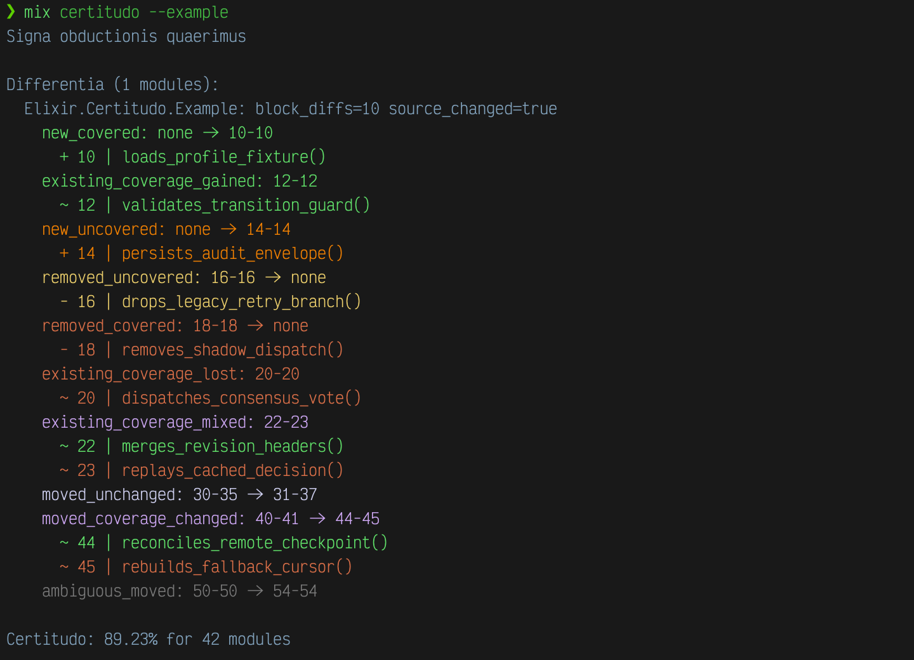

# Certitudo

[](https://hex.pm/packages/certitudo)
[](https://hexdocs.pm/certitudo)
[](https://github.com/sovetnik/certitudo/actions/workflows/elixir.yml)

`certitudo` is an Elixir coverage inspection tool.

It creates versioned coverage snapshots and compares them as executable blocks,
not only as raw line coordinates. The goal is to distinguish real coverage
changes from ordinary source movement during refactoring.



## Installation

```elixir
def deps do
  [
    {:certitudo, "~> 0.1", only: [:dev, :test], runtime: false}
  ]
end
```

## Why

`mix test --cover` answers one question: what percentage of lines is covered right now.

That is useful, but not enough when making large changes. After a refactor or a
new feature, the number may stay the same — and that tells you nothing about what
actually happened inside. Old coverage may have gone away, new coverage may have
arrived, and the total may match by coincidence.

Certitudo is not a test tool; it is an observation tool. You can run it instead
of `mix test`: it runs the tests itself, collects coverage, and builds a snapshot.
The more often you run it, the more granular the history — each snapshot captures
the state at the moment of the run, and any two snapshots can be compared: the
previous one against the current, the start of a task against the end, last
week against today.

The difference is shown at the level of executable blocks, color-coded by the
role of the change — see [Reading The Output](#reading-the-output) for what
each color means. Color is not decoration; it is a role. Red during a refactor
means: a test no longer protects this logic. Orange after a new feature means:
code was written, test was not.

**When you need it:**

- you are doing a large refactor and want to confirm coverage did not quietly
  degrade
- you are adding a feature and want to see which new code has no test yet
- you are reviewing a PR and want to understand what changed in coverage, not
  only in lines

## Name

The name comes from the Calvinist doctrine of *certitudo salutis* — the certainty
of salvation. In that doctrine, the believer reaches assurance not through direct
knowledge but by observing the movement of evidence: fruits point to a state that
cannot otherwise be seen.

The tool transposes that structure into *certitudo obductionis* — the certainty
of coverage. You do not know directly whether code is correct; but you observe
how the evidence moves — which blocks gained coverage, which lost it. This is not
a guarantee; it is reliable knowledge about direction.

Each run is an *impressio* — the present moment, freshly given (Husserl's term
for the primal now-impression, foundational to how phenomenological sociology
accounts for a "now"). It is compared against the *retentio* — what the
previous run still holds (Husserl's retention: the just-past, carried alongside
the present). The two together make a before and an after.

Reading the gap between them is, in the oldest sense of the words, a move from
chaos toward discord: an edit is chaos — an event not yet distinguished — until
the comparison makes the two worlds distinguishable. What
`mix certitudo.discrimen` formalizes as typed differences is *discordia* in the
classical five-phase reading (chaos, discord, confusion, bureaucracy, aftermath
— see *Principia Discordia*). Certitudo is what stands where confusion would
otherwise be: not less uncertainty in general, but a verdict — gained or lost —
at every locus where the gap is real.

## Usage

```bash
mix certitudo
mix certitudo --example
mix certitudo --no-color
mix certitudo --since <run_id_or_snapshot>
mix certitudo.discrimen <left_run> <right_run>
mix certitudo.inspectio [--keep <n>]
mix certitudo.lacunae [module_query]
mix certitudo.speculum <module_query>
```

`mix certitudo` writes:

- `.certitudo/<run_id>/snapshot.json`
- `.certitudo/<run_id>/coverage.coverdata`
- `.certitudo/<run_id>/diff.prev.json` when a previous compatible snapshot exists

History is stored under `.certitudo/`. Use `mix certitudo.inspectio` to review
and prune it. When the directory contains more than 99 valid report runs, the
task prompts for how many fresh reports to keep. Pass `--keep <n>` to skip the
prompt and prune explicitly.

Pass `--no-color` if the primary reader is a machine spirit rather than a
human terminal, for example in plain logs, CI captures, or agent pipelines.

Pass `--example` to render the bundled demonstration diff through Certitudo's
normal console renderer, without running tests or comparing snapshots.

Example output (the `# COLOR:` lines are annotations for this README; run it
yourself in a terminal to see the actual colors):

```text
$ mix certitudo --example --no-color
Signa obductionis quaerimus

example: ~/dev/ex/certitudo/examples/example.diff.json

Differentia (1 modules):
  Elixir.Certitudo.Example: block_diffs=10 source_changed=true
    new_covered: none -> 10-10
      + 10 | loads_profile_fixture()
    existing_coverage_gained: 12-12
      ~ 12 | validates_transition_guard()
    new_uncovered: none -> 14-14
      + 14 | persists_audit_envelope()
      # ORANGE: new executable code exists without coverage
    removed_uncovered: 16-16 -> none
      - 16 | drops_legacy_retry_branch()
    removed_covered: 18-18 -> none
      - 18 | removes_shadow_dispatch()
    existing_coverage_lost: 20-20
      ~ 20 | dispatches_consensus_vote()
      # RED: behavior still exists, but coverage was lost
    existing_coverage_mixed: 22-23
      ~ 22 | merges_revision_headers()
      ~ 23 | replays_cached_decision()
      # PURPLE: one block contains both gain and loss
    moved_unchanged: 30-35 -> 31-37
      # MAGENTA: a line inserted before alias shifted the whole block
    moved_coverage_changed: 40-41 -> 44-45
      ~ 44 | reconciles_remote_checkpoint()
      ~ 45 | rebuilds_fallback_cursor()
    ambiguous_moved: 50-50 -> 54-54
      # CYAN: Certitudo refuses to guess block identity

Certitudo: 89.23% for 42 modules
```

## Reading The Output

The same confidence that lets you tell the Discordian apostles apart — quite a
reservoir of old dogs, that lot — or Mr. Green from Mr. Orange, or one
`Discordia.inferentia` run from the next, applies here: each color names a
role, not a decoration.

| Color   | Status(es)                                          | Meaning |
|---------|------------------------------------------------------|---------|
| Green   | `new_covered`, `existing_coverage_gained`             | Coverage appeared or grew — good news |
| Yellow  | `removed_uncovered`                                   | Uncovered code was removed — cleanup, not loss |
| Orange  | `new_uncovered`                                       | New code has no test yet |
| Red     | `removed_covered`, `existing_coverage_lost`           | Covered behavior disappeared or lost coverage |
| Magenta | `moved_unchanged`                                     | Block moved, coverage stable — refactor noise |
| Cyan    | `ambiguous_moved`                                     | Block identity can't be determined — often duplication |
| Purple  | `existing_coverage_mixed`, `moved_coverage_changed`   | Mixed signal: gains and losses in one block |
| Blue    | —                                                      | Neutral structural output (paths, counters, summaries) |

If color is unavailable or undesirable, `mix certitudo --no-color` keeps the
same textual statuses and ranges without ANSI formatting.

To inspect one module directly:

```bash
mix certitudo.speculum "Certitudo.Coverage"
mix certitudo.lacunae "Certitudo.Coverage"
mix certitudo.lacunae "Certitudo.Coverage" --force
```

`mix certitudo.lacunae --force` rebuilds the selected snapshot from its saved
`coverdata` and saved target project context. It does not create a new run.
